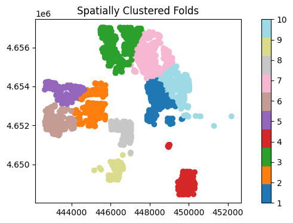
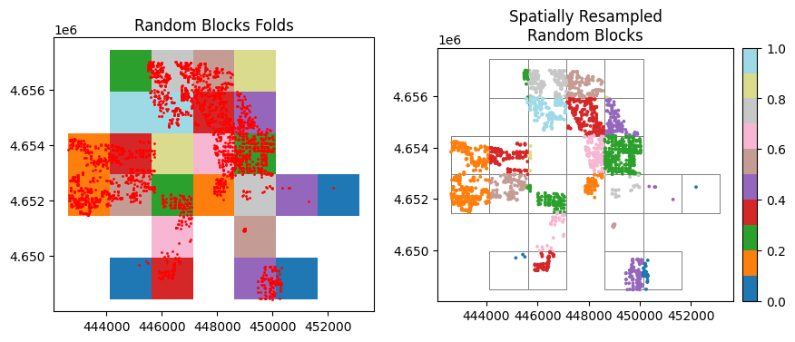

# spatial-kfold
spatial resampling for more robust cross validation in spatial studies

spatial-kfold is a python library for performing spatial resampling to ensure more robust cross-validation in spatial studies. It offers spatial clustering and block resampling technique with  user-friendly parameters to customize the resampling. It enables users to conduct a "Leave Region Out" cross-validation, which can be useful for evaluating the model's generalization to new locations as well as improving the reliability of [feature selection](https://doi.org/10.1016/j.ecolmodel.2019.108815) and [hyperparameter tuning](https://doi.org/10.1016/j.ecolmodel.2019.06.002) in spatial studies


# Main Features

spatial-kfold allow to conduct "Leave Region Out" using two spatial resampling techniques:

* Spatial clustering with kmeans
* spatial blocks

# Installation

spatial-kfold can be installed from [PyPI](https://pypi.org/project/spatial-kfold/)

```
pip install spatial-kfold
```

# Example 

```python
from spatialkfold import load_data
from spatialkfold import spatial_kfold_clusters 
from spatialkfold import spatial_blocks , spatial_kfold_blocks
from spatialkfold.plotting import spatial_kfold_plot
from spatialkfold.stats import spatial_kfold_stats

import matplotlib.pyplot as plt
from matplotlib import cm
from matplotlib.colors import colors, ListedColormap, LinearSegmentedColormap
from mpl_toolkits.axes_grid1 import make_axes_locatable
import numpy as np
import pandas as pd
import seaborn as sns

from sklearn import preprocessing
from sklearn.linear_model import LinearRegression
from sklearn.model_selection import KFold 
from sklearn.model_selection import LeaveOneGroupOut 
from sklearn.model_selection import cross_validate

# load ames data
ames = load_data()
ames_prj = ames.copy().to_crs(ames.estimate_utm_crs())
ames_prj['id'] = range(len(ames_prj))

# 1. Spatial cluster resampling 
ames_clusters = spatial_kfold_clusters (gdf= ames_prj, name = 'id', nfolds = 10, random_state =569) 

# Get the 'tab20' colormap
cols_tab = cm.get_cmap('tab20', 10)
# Generate a list of colors from the colormap
cols = [cols_tab(i) for i in range(10)]
# create a color ramp
color_ramp = ListedColormap(cols)


fig, ax = plt.subplots(1,1 , figsize=(9, 4)) 
ames_clusters.plot(column = 'folds', ax = ax, cmap = color_ramp, legend = True)
ax.set_title('Spatially Clustered Folds')
plt.show()
```

<p align="center">
  
</p>


```python

# 2.1 spatial resampled random blocks

# create 10 random blocks 
ames_rnd_blocks = spatial_blocks(ames_prj, width = 1500, height = 1500, 
                                 method = 'random', nfolds = 10, 
                                 random_state = 135)

# resample the ames data with the prepared blocks 
ames_res_rnd_blk = spatial_kfold_blocks (ames_prj, ames_rnd_blocks)

# plot the resampled blocks
fig, ax = plt.subplots(1,2 , figsize=(10, 6)) 
# plot 1
ames_rnd_blocks.plot(column = 'folds',cmap = color_ramp, ax = ax[0] ,lw=0.7, legend = False)
ames_prj.plot(ax=ax[0],  markersize = 1, color = 'r')
ax[0].set_title('Random Blocks Folds')

# plot 2
ames_rnd_blocks.plot(facecolor="none",edgecolor='grey', ax = ax[1] ,lw=0.7, legend = False)
ames_res_rnd_blk.plot(column = 'folds', cmap = color_ramp,legend = False, ax = ax[1], markersize = 3)
ax[1].set_title('Spatially Resampled\nRandom Blocks')

# add colorbar to plot 2
divider = make_axes_locatable(ax[1])
cax = divider.append_axes("right", size="5%", pad=0.1)
sm = plt.cm.ScalarMappable(cmap=color_ramp)
sm.set_array([])
plt.colorbar(sm, ax=ax[1], cax=cax)

plt.show()
```

<p align="center">
  
</p>