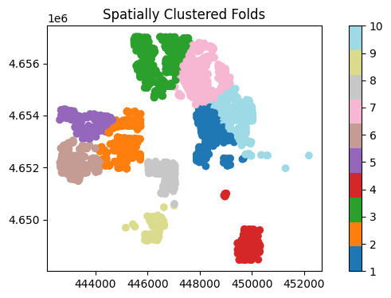
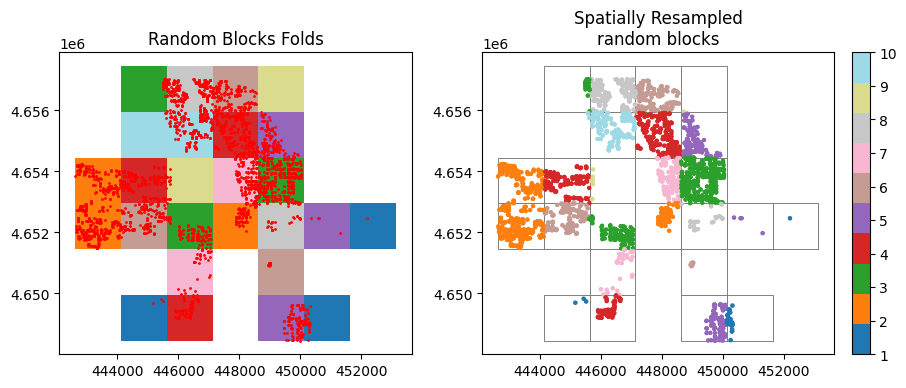
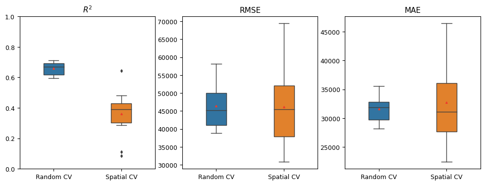

# spatial-kfold
[](https://pypi.org/project/spatial-kfold/)
[](https://opensource.org/licenses/MIT)

spatial resampling for more robust cross validation in spatial studies

spatial-kfold is a python library for performing spatial resampling to ensure more robust cross-validation in spatial studies. It offers spatial clustering and block resampling technique with  user-friendly parameters to customize the resampling. It enables users to conduct a "Leave Region Out" cross-validation, which can be useful for evaluating the model's generalization to new locations as well as improving the reliability of [feature selection](https://doi.org/10.1016/j.ecolmodel.2019.108815) and [hyperparameter tuning](https://doi.org/10.1016/j.ecolmodel.2019.06.002) in spatial studies


Spatial-kfold can be integrated easily with scikit-learn's [LeaveOneGroupOut](https://scikit-learn.org/stable/modules/generated/sklearn.model_selection.LeaveOneGroupOut.html) cross-validation technique. This integration enables you to further leverage the resampled spatial data for performing feature selection and hyperparameter tuning.

# Main Features

spatial-kfold allow to conduct "Leave Region Out" using two spatial resampling techniques:

* 1. Spatial clustering with kmeans
* 2. Spatial blocks
    * Random blocks
    * Continuous blocks 
        * tb-lr : top-bottom, left-right
        * bt-rl : bottom-top, right-left

# Installation

spatial-kfold can be installed from [PyPI](https://pypi.org/project/spatial-kfold/)

```
pip install spatial-kfold
```

# Example 

## 1. Spatial clustering with kmeans [](https://github.com/WalidGharianiEAGLE/spatial-kfold/blob/main/notebooks/spatialkfold_intro.ipynb)

```python
from spatialkfold import load_data
from spatialkfold import spatial_kfold_clusters 
from spatialkfold import spatial_blocks , spatial_kfold_blocks

import matplotlib.pyplot as plt
from matplotlib import cm
import matplotlib.colors as colors
from matplotlib.colors import ListedColormap, LinearSegmentedColormap
from mpl_toolkits.axes_grid1.inset_locator import inset_axes

# load ames data
ames = load_data()
ames_prj = ames.copy().to_crs(ames.estimate_utm_crs())
ames_prj['id'] = range(len(ames_prj))

# 1. Spatial cluster resampling 
ames_clusters = spatial_kfold_clusters (gdf= ames_prj, name = 'id', nfolds = 10, random_state =569) 

# Get the 'tab20' colormap
cols_tab = cm.get_cmap('tab20', 10)
# Generate a list of colors from the colormap
cols = [cols_tab(i) for i in range(10)]
# create a color ramp
color_ramp = ListedColormap(cols)


fig, ax = plt.subplots(1,1 , figsize=(9, 4)) 
ames_clusters.plot(column = 'folds', ax = ax, cmap = color_ramp, legend = True)
ax.set_title('Spatially Clustered Folds')
plt.show()
```

<p align="center">
  
</p>

## 2. Spatial blocks [](https://github.com/WalidGharianiEAGLE/spatial-kfold/blob/main/notebooks/spatialkfold_intro.ipynb)

```python

# 2.1 spatial resampled random blocks  

# create 10 random blocks 
ames_rnd_blocks = spatial_blocks(ames_prj, width = 1500, height = 1500, 
                                 method = 'random', nfolds = 10, 
                                 random_state = 135)

# resample the ames data with the prepared blocks 
ames_res_rnd_blk = spatial_kfold_blocks (ames_prj, ames_rnd_blocks)

# plot the resampled blocks
fig, ax = plt.subplots(1,2 , figsize=(10, 6)) 

# plot 1
ames_rnd_blocks.plot(column = 'folds',cmap = color_ramp, ax = ax[0] ,lw=0.7, legend = False)
ames_prj.plot(ax=ax[0],  markersize = 1, color = 'r')
ax[0].set_title('Random Blocks Folds')

# plot 2
ames_rnd_blocks.plot(facecolor="none",edgecolor='grey', ax = ax[1] ,lw=0.7, legend = False)
ames_res_rnd_blk.plot(column = 'folds', cmap = color_ramp,legend = False, ax = ax[1], markersize = 3)
ax[1].set_title('Spatially Resampled\nrandom blocks')


im1 = ax[1].scatter(ames_res_rnd_blk.geometry.x , ames_res_rnd_blk.geometry.y, c=ames_res_rnd_blk['folds'],
                 cmap=color_ramp, s=5)

axins1 = inset_axes(
    ax[1],
    width="5%",  # width: 5% of parent_bbox width
    height="50%",  # height: 50%
    loc="lower left",
    bbox_to_anchor=(1.05, 0, 1, 2),
    bbox_transform=ax[1].transAxes,
    borderpad=0
)
fig.colorbar(im1, cax=axins1,  ticks= range(1,11))

plt.show()
```

<p align="center">
  
</p>

## 3. Compare Random and Spatial cross validation [](https://github.com/WalidGharianiEAGLE/spatial-kfold/blob/main/notebooks/spatialkfold_intro.ipynb)

<p align="center">
  
</p>

# Resources

A list of tutorials and resources mainly in R explaining the importance of saptial resampling and spatial cross validation

*  [Hanna Meyer: "Machine-learning based modelling of spatial and spatio-temporal data"](https://www.youtube.com/watch?v=QGjdS1igq78&t=1271s)
* [Jannes Münchow: "The importance of spatial cross-validation in predictive modeling"](https://www.youtube.com/watch?v=1rSoiSb7xbw&t=649s)
* [Julia Silge: Spatial resampling for more reliable model evaluation with geographic data ](https://www.youtube.com/watch?v=wVrcw_ek3a4&t=904s)

# Credits

This package was inspired by the following R packages.

* [CAST](https://github.com/HannaMeyer/CAST/)
* [spatialsample](https://github.com/tidymodels/spatialsample/) 

# Dependencies

This project relies on the following dependencies:
* [pandas](https://pandas.pydata.org)
* [numpy](https://numpy.org)
* [geopandas](https://geopandas.org)
* [shapely](https://shapely.readthedocs.io)
* [matplotlib](https://matplotlib.org)
* [scikit-learn](https://scikit-learn.org)

# Bibliography

Meyer, H., Reudenbach, C., Wöllauer, S., Nauss, T. (2019): Importance of spatial predictor variable selection in machine learning applications - Moving from data reproduction to spatial prediction. Ecological Modelling. 411. https://doi.org/10.1016/j.ecolmodel.2019.108815

Schratz, Patrick, et al. "Hyperparameter tuning and performance assessment of statistical and machine-learning algorithms using spatial data." Ecological Modelling 406 (2019): 109-120. https://doi.org/10.1016/j.ecolmodel.2019.06.002

Schratz, Patrick, et al. "mlr3spatiotempcv: Spatiotemporal resampling methods for machine learning in R." arXiv preprint arXiv:2110.12674 (2021). https://arxiv.org/abs/2110.12674

Valavi, Roozbeh, et al. "blockCV: An r package for generating spatially or environmentally separated folds for k-fold cross-validation of species distribution models." Biorxiv (2018): 357798. https://doi.org/10.1101/357798 
